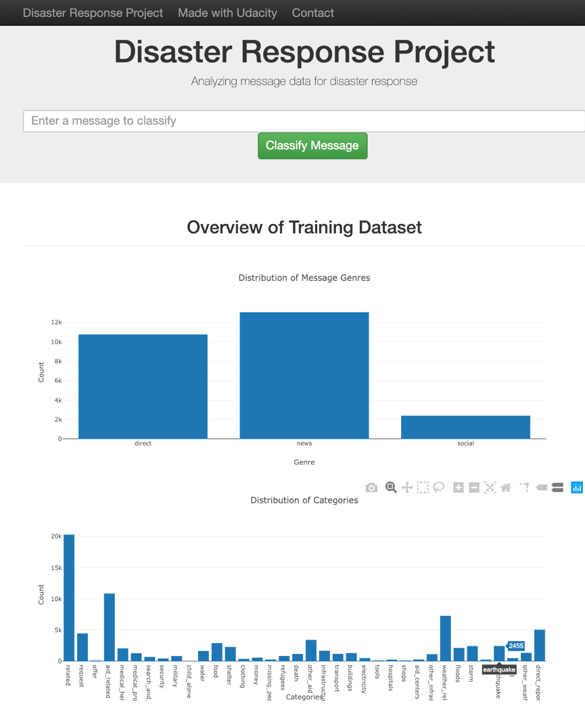
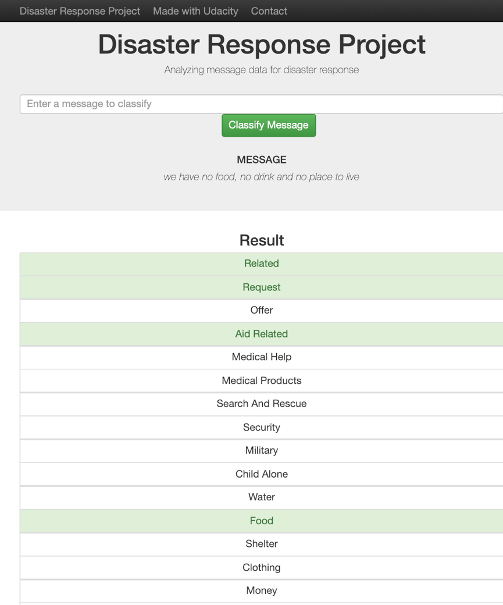

**Table of contents**
- [Introduction](#introduction)
- [Training dataset](#training-dataset)
- [Installation](#installation)
- [Project file structure](#project-file-structure)
- [How to run the cold](#how-to-run-the-cold)
  - [Clean the original dataset](#clean-the-original-dataset)
  - [Train a classifier](#train-a-classifier)
  - [Run the Flask Web application from console](#run-the-flask-web-application-from-console)
- [Screenshot](#screenshot)

# Introduction
This project builds a Web applicaiton to classify disaster messages. In the project, ETL pipeline techniques are used to clean the dataset, and ML pipeline techniques are used to train a machine learning model which will perform message classification for the Web application. 

# Training dataset
The training dataset can be found at [Figure Eight](https://www.figure-eight.com/).

# Installation
In order to run the code of this project, you need to install the followding python packages, and the version of each packages can be found at the `requirements.txt` file:
1. pandas
2. nltk
3. sqlalchemy
4. scikit-learn
5. plotly
6. jupyter notebook

# Project file structure
- **data:** contains the training dataset, sqlite database for storing the cleaned dataset, and the ETL pipeline script.
- **models:** contains the ML pipeline script, and the classifier model.
- **app:** contains the Flask Web application files.

# How to run the cold
## Clean the original dataset
`python data/process_data.py path/to/disaster_message.csv path/to/disaster_catories.csv path/to/yourdatabase.db`
## Train a classifier
`python models/train_classifier.py path/to/yourdatabase.db`
## Run the Flask Web application from console
`python app/application.py`

# Screenshot

